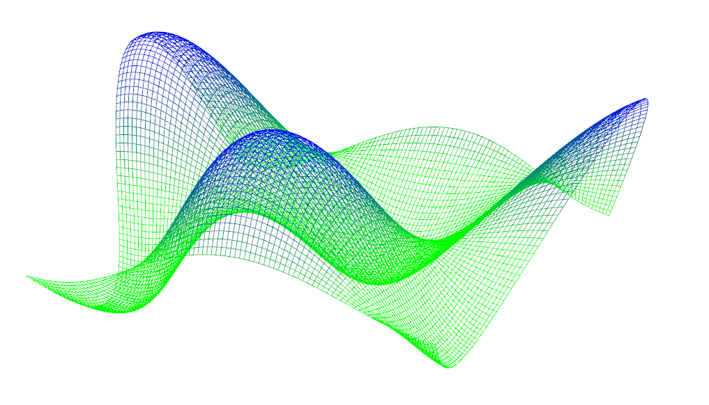

CIS 565 Project5 : WebGL
===================

Fall 2014

Author: Dave Kotfis

##Overview

###Part 1: Wave Vertex Shading

This component of the project consists of procedurally animating and coloring a wireframe using a GLSL vertex shader in WebGL. This uses a javascript GUI element for the user to select 2 colors, and the shader interpolates between them based on height.

There are two different wave calculations. One is based on sine and cosine functions in cartesian space, and the other uses positive and negative gaussian bumps moving in ellipsoid patterns.

###Part 2: Global Fragment Shading

This component of the project consists of shading the surface of a globe using a fragment shader. It utilizes textures containing a terrain, night-lighting, clouds, and elevation data. It blends between night and day coloring based on the relative direction of the normal and the sun. It only implements a specular reflection from water surfaces. Bump mapping creates diffuse shading on land that show mountains. A rim coloring method creates an atmospheric effect.

I also implemented an elevation based shading scheme that darkens areas that are further away.

##Results

Here are some screenshots of the vertex shaders from part 1. Click on an image to demo.

[] (http://dkotfis.github.io/Project5-WebGL/vert_wave.html)

[![Gaussian Vertex Shader] (resources/Gaussians.png)] (http://dkotfis.github.io/Project5-WebGL/moving_gaussian.html)

Here are some screenshots of the fragment globe shaders from part 2. The first is without the altitude shading, and the other includes it. Click on the second image to demo.

![WebGL Globe] (resources/NoElevationShading.png)

[![WebGL Globe With Extended Features] (resources/ElevationShading.png)] (http://dkotfis.github.io/Project5-WebGL/frag_globe.html)

##Performance Evaluation

No current performance evaluation to show since I have not gotten stats.js to work.
